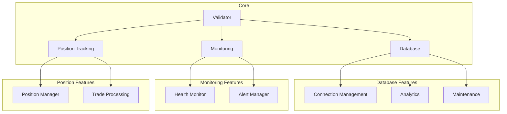

# Alpha Trade Exchange Subnet

## Overview
The Alpha Trade Exchange subnet is a specialized Bittensor subnet for tracking and validating trading performance. It provides a robust infrastructure for position tracking, performance monitoring, and validator scoring.

## Architecture


## Package Structure

### `/database`
Core database functionality including:
- Connection management
- Query analytics
- Data maintenance
- Schema management

[Database Package Documentation](database/README.md)

### `/validator`
Validator node implementation including:
- Position tracking
- Performance monitoring
- Weight setting
- Event processing

[Validator Package Documentation](validator/README.md)

### `/monitoring`
System monitoring and alerting including:
- Health monitoring
- Alert management
- Metric collection
- Performance analysis

[Monitoring Package Documentation](monitoring/README.md)

## Key Features

1. **Position Tracking**
   - FIFO accounting
   - Partial closes
   - Performance metrics
   - Trade history

2. **Database Management**
   - Async operations
   - Connection pooling
   - Transaction management
   - Data archival

3. **System Monitoring**
   - Health checks
   - Alert generation
   - Metric collection
   - Performance analysis

4. **Validator Operations**
   - Metagraph sync
   - Weight setting
   - Event processing
   - State management

## Installation

```bash
# Clone repository
git clone https://github.com/your-org/alpha-trade-exchange-subnet.git

# Install dependencies
pip install -r requirements.txt

# Install package
pip install -e .
```

## Usage

```python
from alphatrade.validator import Validator
from alphatrade.database import DatabaseManager
from alphatrade.monitoring import HealthMonitor

# Initialize components
db = DatabaseManager("alpha_trade.db")
validator = Validator(config)
monitor = HealthMonitor(config)

# Start validator
await validator.start()

# Monitor health
metrics = await monitor.get_health_metrics()
```

## Configuration

The subnet can be configured through:
1. Environment variables
2. Configuration files
3. Command line arguments

See [Configuration Guide](docs/configuration.md) for details.

## Development

### Setup Development Environment
```bash
# Create virtual environment
python -m venv venv
source venv/bin/activate

# Install development dependencies
pip install -r requirements-dev.txt
```

### Running Tests
```bash
# Run all tests
pytest

# Run specific test file
pytest tests/test_validator.py

# Run with coverage
pytest --cov=alphatrade
```

### Code Style
- Follow PEP 8
- Use type hints
- Write docstrings
- Add unit tests

## Dependencies
- Python 3.7+
- SQLAlchemy
- aiosqlite
- bittensor
- psutil
- numpy

## Contributing
1. Fork repository
2. Create feature branch
3. Commit changes
4. Create pull request

See [Contributing Guide](docs/contributing.md) for details.

## License
MIT License - see [LICENSE](LICENSE) for details 