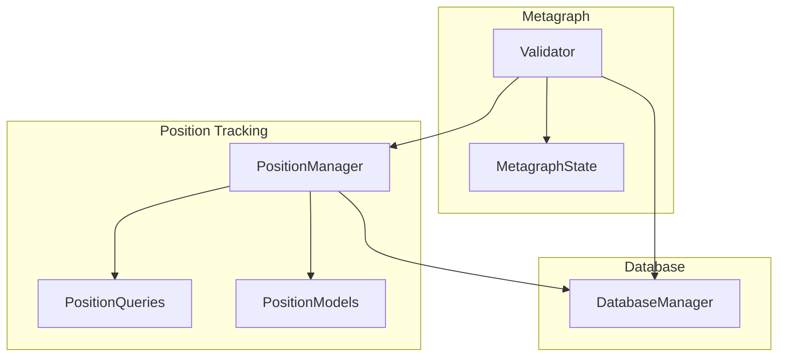

# Validator Package

## Overview
This package implements the validator node functionality for the Alpha Trade Exchange subnet. It handles position tracking, performance monitoring, and weight setting based on miner performance.

## Architecture


## Module Responsibilities

### Core Modules

#### `validator.py`
- Main validator node implementation
- Metagraph state synchronization
- Weight setting and scoring
- Event processing

### Position Tracking

#### `position_tracking/manager.py`
- Position lifecycle management
- Trade processing
- FIFO accounting
- Performance metrics

#### `position_tracking/queries.py`
- Position-related database queries
- Trade queries
- Performance statistics queries
- State queries

#### `position_tracking/models.py`
- Position data models
- Trade data models
- Status enums
- Relationship models

## Key Features

1. **Position Tracking**
   - Accurate FIFO accounting
   - Partial position closes
   - Performance metrics
   - Trade history

2. **Performance Monitoring**
   - ROI calculation
   - Win rate tracking
   - Duration metrics
   - Volume statistics

3. **Weight Setting**
   - Performance-based scoring
   - Time-weighted metrics
   - Automatic updates
   - Threshold management

4. **State Management**
   - Metagraph synchronization
   - State recovery
   - Event processing
   - Data consistency

## Usage Example

```python
# Initialize validator
validator = Validator(config)

# Process events
await validator.forward()

# Get performance metrics
stats = await validator.get_miner_performance(uid=1)

# Set weights
await validator.set_weights()
```

## Dependencies
- bittensor
- SQLAlchemy
- aiosqlite
- numpy

## Best Practices
1. Regular metagraph synchronization
2. Proper event ordering
3. Performance metric monitoring
4. State validation
5. Error handling and recovery 