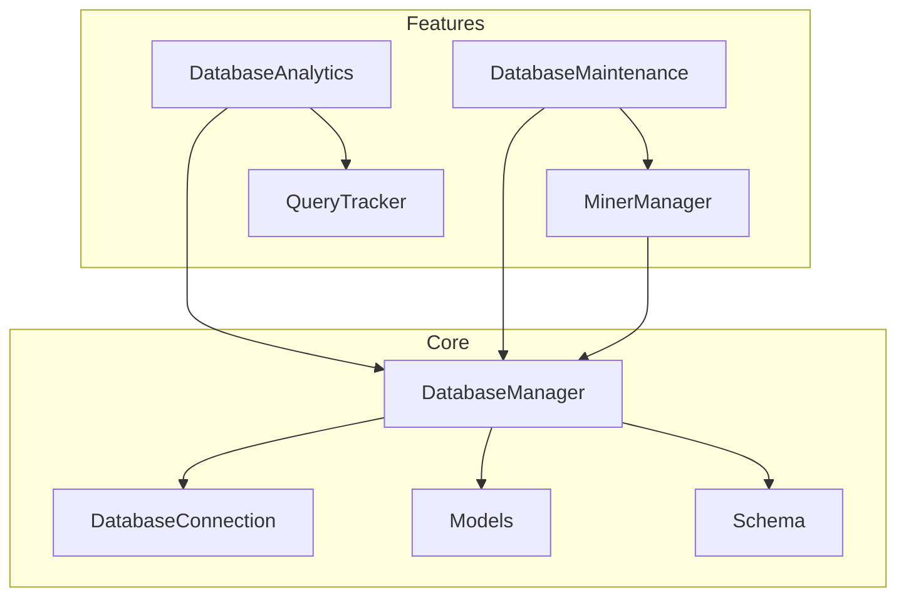

# Database Package

## Overview
This package provides the database infrastructure for the Alpha Trade Exchange subnet. It implements a robust, asynchronous SQLite database with connection pooling, transaction management, and comprehensive analytics.

## Architecture


## Module Responsibilities

### Core Modules

#### `manager.py`
- Singleton database manager
- High-level interface for database operations
- Database initialization and setup
- Session and connection management

#### `connection.py`
- Low-level connection handling
- SQLAlchemy engine configuration
- Transaction management
- Connection pooling

#### `models.py`
- SQLAlchemy model definitions
- Data class definitions
- Enums and type definitions
- Base model configuration

#### `schema.py`
- SQL table definitions
- Index definitions
- Archive table schemas
- Database structure

### Feature Modules

#### `miner.py`
- Miner registration and management
- Miner-specific table creation
- Status tracking
- Miner queries

#### `analytics.py`
- Query performance monitoring
- Pattern analysis
- Index usage tracking
- Table relationship analysis

#### `maintenance.py`
- Database state recovery
- Integrity verification
- Performance optimization
- Data cleanup

#### `query_tracker.py`
- Query execution tracking
- Slow query identification
- Query pattern normalization
- Performance statistics

## Key Features

1. **Connection Management**
   - Asynchronous SQLite operations
   - Connection pooling with SQLAlchemy
   - WAL journal mode for concurrent access
   - Automatic connection cleanup

2. **Transaction Management**
   - ACID compliance
   - Automatic rollback on errors
   - Write lock for serialization
   - Session management

3. **Performance Monitoring**
   - Query pattern analysis
   - Index usage tracking
   - Slow query detection
   - Table relationship analysis

4. **Data Integrity**
   - Foreign key constraints
   - Index validation
   - State recovery
   - Data archival

## Usage Example

```python
# Get singleton instance
db = DatabaseManager("alpha_trade.db")

# Initialize database
await db.setup_database()

# Get a session for database operations
async with db.session() as session:
    # Perform database operations
    ...

# Close connections when done
await db.close()
```

## Dependencies
- SQLAlchemy (async)
- aiosqlite
- sqlparse
- Python 3.7+

## Best Practices
1. Always use context managers for sessions and connections
2. Use transactions for write operations
3. Monitor query performance with analytics
4. Regularly run maintenance tasks
5. Handle connection cleanup properly 