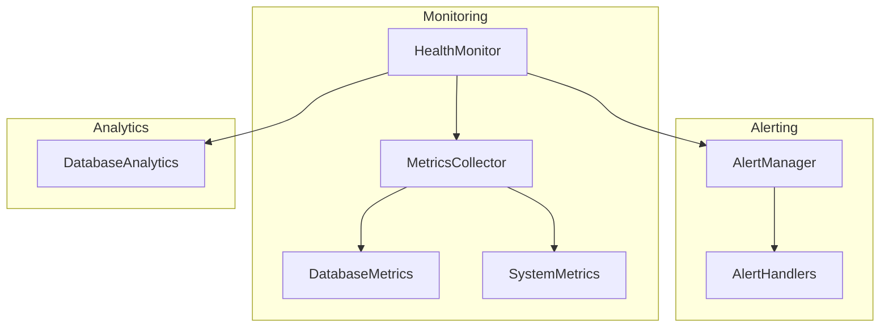

# Monitoring Package

## Overview
This package provides system monitoring and alerting functionality for the Alpha Trade Exchange subnet. It tracks system health, performance metrics, and generates alerts for potential issues.

## Architecture


## Module Responsibilities

### Core Modules

#### `health.py`
- System health monitoring
- Resource usage tracking
- Performance metrics collection
- Health status reporting

#### `alerts.py`
- Alert generation and management
- Threshold monitoring
- Alert routing
- Alert history

#### `metrics.py`
- Metric collection and aggregation
- Performance data
- Resource utilization
- System statistics

## Key Features

1. **Health Monitoring**
   - Database connection health
   - System resource usage
   - Background task status
   - Performance metrics

2. **Alert Management**
   - Configurable thresholds
   - Multiple severity levels
   - Alert routing
   - Alert history

3. **Metric Collection**
   - Database metrics
   - System metrics
   - Performance data
   - Resource utilization

4. **Performance Analysis**
   - Query performance
   - Resource bottlenecks
   - System capacity
   - Trend analysis

## Usage Example

```python
# Initialize monitoring
monitor = HealthMonitor(config)
alert_manager = AlertManager(config)

# Get health metrics
metrics = await monitor.get_health_metrics()

# Check for alerts
if alert := alert_manager.check_metrics(metrics):
    await alert_manager.process_alert(alert)

# Get performance data
perf_data = await monitor.get_performance_metrics()
```

## Alert Types

1. **Database Alerts**
   - Connection pool usage
   - Query performance
   - Lock contention
   - Storage space

2. **System Alerts**
   - CPU usage
   - Memory usage
   - Disk space
   - Network latency

3. **Application Alerts**
   - Task failures
   - Error rates
   - Response times
   - Queue lengths

## Dependencies
- psutil
- SQLAlchemy
- aiosqlite
- prometheus_client (optional)

## Best Practices
1. Regular metric collection
2. Appropriate alert thresholds
3. Alert response procedures
4. Metric retention policies
5. Performance baseline monitoring 